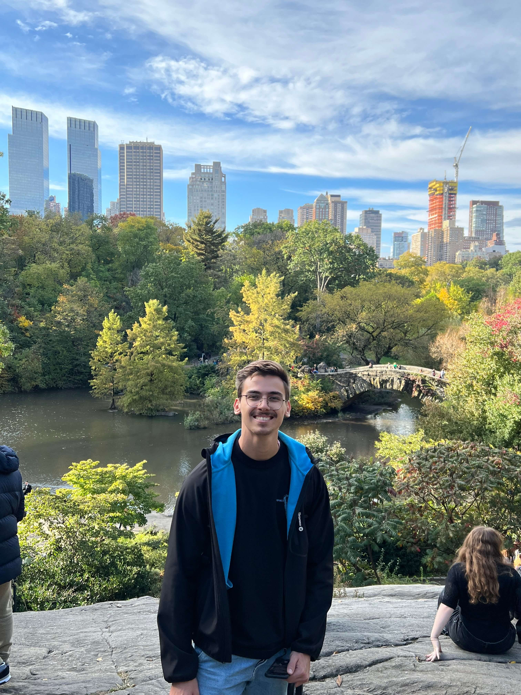

+++
title = "Learn more about Quique"
+++

# About me

My full name is Enrique Kessler Martínez, nice to meet you! I am a Software Development Engineer II at Amazon, where we serve In-App and Push Notifications to Kindle Customers in iOS, Android and FireOS. I studied Computer Engineering at the University of Murcia.

I was born in Murcia, Spain and I have lived in the region my entire life (Cartagena :muscle:), benefiting from the amazing weather and the kind people. I have been in nature a lot since my childhood, being part of a Scout group and by going on hikes are runs anytime I have the chance.

I love learning, both from books and the internet. I work on personal projects to pick up new technologies and keep myself learning every day. On this website, I will publish most of my findings of the amazing world that we live in in the form of book reviews, notes and articles. I believe the openness will help me improve personally and professionally. Buckle up!

## Timeline

### 2023

- Promotion to SDE II: After working for a year an a half in the Kindle Notifications team, I had the opportunity to deliver a 6 months long project, successfully and was promoted!

### 2022

- Work from home: After 5 months of living in Madrid, asked my manager to work from home, and moved back to Murcia, closer to family and Nuria!
- Kindle Notifications: Started working on the Kindle Notifications team, learning an architecture that was transitioned to us from a team in Seattle.
- Amazon Return Offer: After working as an intern for 3 months, I was offered to return to Amazon full-time, as a Software Development Engineer I. I was asked to move to Madrid.

### 2021

- Hired as an SDE Intern at Amazon: After a long selection process, I was extremely proud of being selected.
- Met Nuria: My amazing, smart, beautiful girlfriend.

### 2020

- Covid hit in Spain for the first time: Around March we had the first Covid cases in Spain, and stayed at home for a month an a half. I was moved to work as a primary worker in El Corte Ingles.

## Travel Map


{
    "type": "FeatureCollection",
    "features": [
        {
            "coordinates": [-3.47, 36.91],
            "text": "Lanjarón - Aug 2020"
        },
        {
            "coordinates": [3.27, 43.9],
            "text": "Occitanie - Aug 2020"
        },
        {
            "coordinates": [23.72, 37.98],
            "text": "Greece - Aug 2019"
        },
        {
            "coordinates": [7.1, 47.8],
            "text": "Thann - 1999-2021"
        },
        {
            "coordinates": [-6.37, 39.47],
            "text": "Extremadura - Aug 2018"
        },
        {
            "coordinates": [-3.67, 40.42],
            "text": "Madrid - Jun 2018"
        },
        {
            "coordinates": [-8.54, 42.8],
            "text": "Camino de Santiago - Aug 2016"
        },
        {
            "coordinates": [14.5, 46.05],
            "text": "Slovenia - Aug 2011"
        },
        {
            "coordinates": [-5.87, 43.34],
            "text": "Asturias - Aug 2010"
        },
        {
            "coordinates": [6.45, 45.902],
            "text": "La Clusaz - Aug 2010"
        },
        {
            "coordinates": [-6.29, 53.33],
            "text": "Dublin - Aug 2009"
        },
        {
            "coordinates": [-6.29, 53.33],
            "text": "Dublin - Aug 2009"
        },
        {
            "coordinates": [-3.7, 42.34],
            "text": "Burgos - Aug 2009"
        },
        {
            "coordinates": [-4.75, 41.63],
            "text": "Valladolid - Aug 2008"
        },
        {
            "coordinates": [12.18, 45.45],
            "text": "Venecia - Oct 2016"
        },
        {
            "coordinates": [12.48, 41.89],
            "text": "Roma - Oct 2016"
        },
        {
            "coordinates": [11.25, 43.76],
            "text": "Florencia - Oct 2016"
        },
        {
            "coordinates": [-0.1, 51.5],
            "text": "London - Oct 2015"
        },
        {
            "coordinates": [-1.86, 38.99],
            "text": "Caravaca de la Cruz - 1999-2021"
        },
        {
            "coordinates": [13.44, 52.5],
            "text": "Berlin - Aug 2018"
        },
        {
            "coordinates": [7.7, 48.25],
            "text": "Europa Park - Aug 2016"
        },
        {
            "coordinates": [-3.39, 37.09],
            "text": "Sierra Nevada - Feb 2018"
        },
        {
            "coordinates": [14.43, 50.07],
            "text": "Prague - Aug 2018"
        },
        {
            "coordinates": [4.89, 52.37],
            "text": "Amsterdam - Aug 2018"
        },
        {
            "coordinates": [2.34, 48.86],
            "text": "Paris - Sept 2022"
        },
        {
            "coordinates": [-1.8, 38.99],
            "text": "Albacete - Mar 2018"
        }
    ]
}

